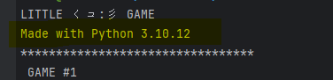
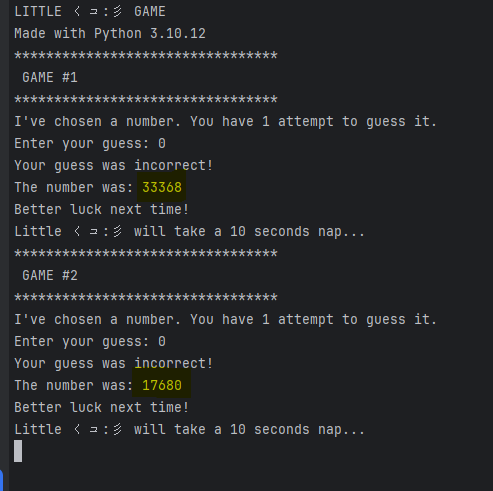

# Solution

- Make sure you're using the same python version as the one used in the game otherwise, the RNGs might behave
  differently.

  
  
  **IMPORTANT: USE THE PYTHON VERSION THAT THE RUNNING CHALLENGE GIVES YOU, NOT THE ONE ON THE SCREENSHOT.** 

- Fail 2 times (or more), and collect the generated numbers (for instance, `39475` and `21199`)
  

- In [solution.py](./solution.py), populate `generated_numbers` with the collected numbers:

    ```
    generated_numbers = [
        39475,
        21199
    ]
    ```
- Execute `solution.py`. It should give you the next number.
    ```
    Next number to guess is 44255
    ```
- Enter the number to the game, and get the flag.
